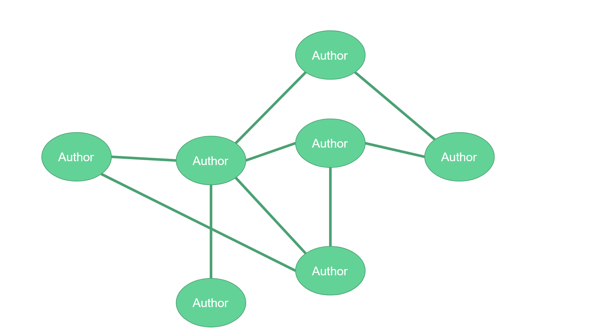
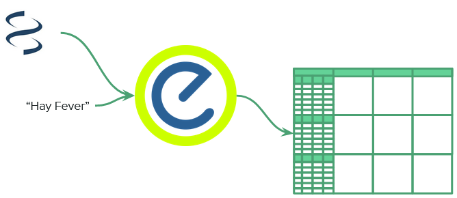
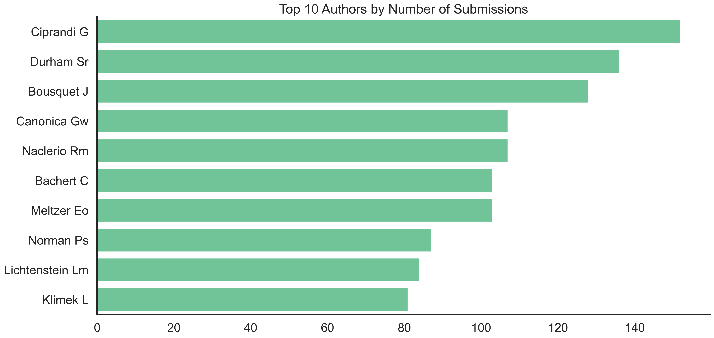
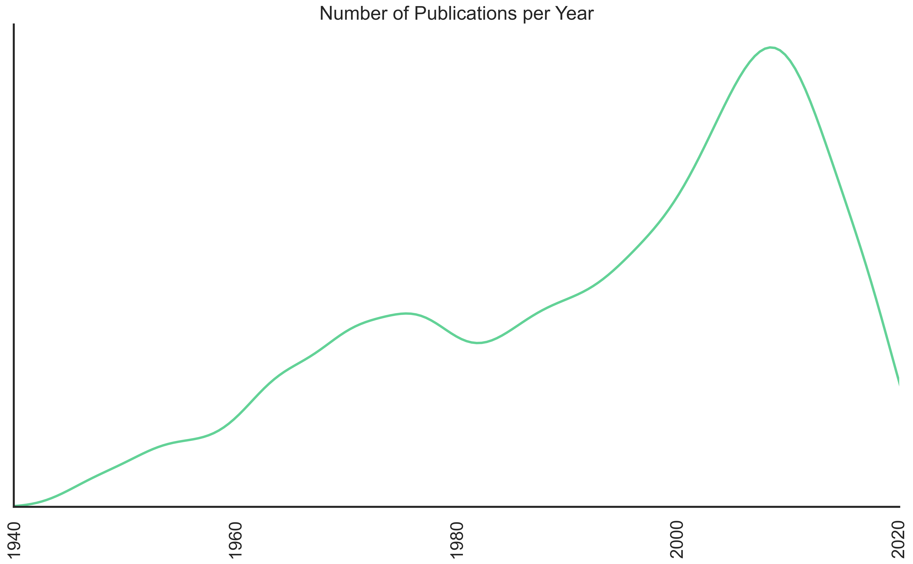
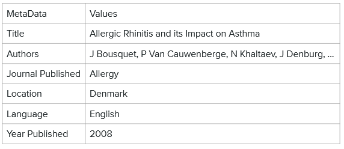
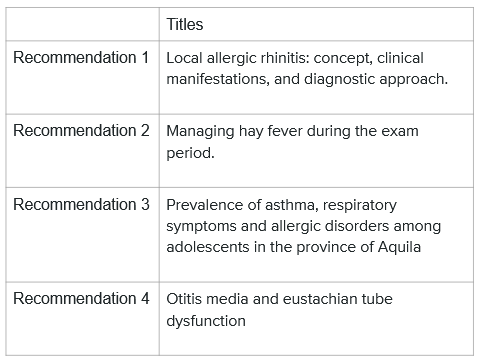
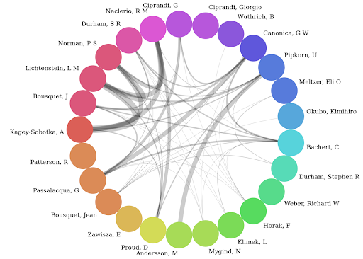
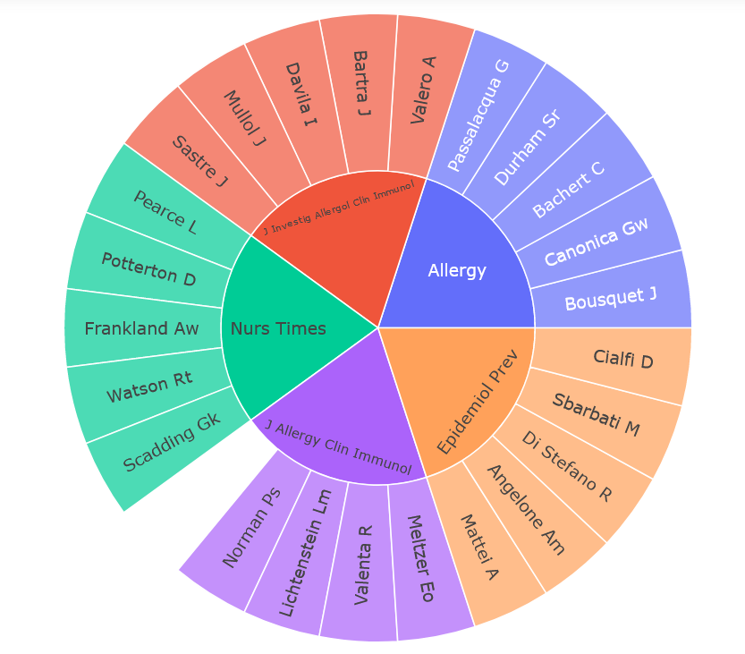

# Scholarly Recommender
___

# Table of Contents
- [Presentation Notebook](https://github.com/awyeh64/Scholarly_Recommender/blob/main/notebooks/report/report_notebook.ipynb)
- [Presentation Powerpoint]( https://github.com/awyeh64/Scholarly_Recommender/blob/main/reports/Scholarly_Recommender_PowerPoint.pdf)
- [EDA](https://github.com/awyeh64/Scholarly_Recommender/blob/main/notebooks/exploratory/eda_fsm.ipynb)

# Introduction

This project is called the Scholarly Data Recommender, and it is a recommender system model in the form of a search engine where if a user inputs a keyword, it will pull scholarly data from the National Center for Biotechnology Information, recommend several documents that are the most relevant to the keyword, and then provides extra analytics on the scholarly network so that the user can further expand their research.

First, I should explain a bit on what scholarly data is. Normally, the data we work with is solely related to our individual projects.

However, "scholarly" data is a term created recently for databases which not only include the project data, but also metadata such as authors, papers, citations, figures, tables, etc.  (It is known as "scholarly" due to its main use by academics)

By combining information on scholarly data, we are able to form what is called a scholarly network, which can be a network of authors, journals, institutions, etc. that are connected together through collaborative works and relationships. By understanding this, we can learn about things outside of the projects such as how researchers interact with each other, find relationships between researchers hidden in citation networks, observe impact of funding in an institution, or allocate resources to different departments.  However, for the purposes of this project, our goal is simply to explore our own scholarly network by looking at extra authors or journals that could be helpful for research topics.

# Data Extraction

For our model, we will use the NCBI, or the National Center for Biotechnology Information as our data source.  This is a vast online resource containing an innumerable amount of documents, all relating to biology and medicine.

When it comes to data extraction however, we will want to use Entrez which is NCBI's primary text search and retrieval system.  This has a very convenient python package that lets us pull scholarly data from the NCBI servers directly to our notebooks.

Putting it all together, our code submits a keyword using the entrez python package, and in the case of this example, we will be using the term 'hay fever'; entrez will search NCBI for any documents relating to hay fever and return anything that it can find for us to input into our dataframes.

# EDA

To begin we can do some simple exploratory data analysis. Here we can view the authors that contributed the most amount of publications to our search term.

Next we can look at the number of publications in the past century.  It seems like the number of submitted publications peaked at around 2010 but has slowly gone down ever since; this could be due to lack of interest after enough research has been done or just that the collection of documents is incomplete.

# Data Imputing through Classification Modeling

To actually choose significant documents, we want documents that are high quality enough to have made an impact on the academic community.  A good metric for determining this is by how many times a document has been referenced or cited by others, as a document that has been widely used is sure to be significant.

However an issue that we have is that not all documents have reference numbers.  This could simply be because that the document hasn't been exposed to certain communities yet, and since we don't want to disregard the fact that an unknown person in the middle of nowhere could still write an amazing paper, we can use NLP with a logistic regression model and have its significance as its target variable.  With our model, we want to focus on precision, as we want to make sure the documents the model classifies are truly positive.

# Finding Recommended Documents

After using our model to predict significance of unknown documents, we can merge them back with the other data and choose the document with the most reference numbers out of the documents that we consider significant. In this case we have the document Allergic Rhinitis and its Impact on Asthma.

Next we can take our best document and then discover similar ones using cosine similarity in a content-based recommendation system.

# Explanatory Data Analysis

In the end we have some explanatory data analysis.  Explanatory data is different compared to exploratory as exploratory is more for initial data visualization while explanatory is more for visualizing the results.

One such way is through an author collaboration plot.  In here, we have the top 30 authors plotted in a circle, with a line connecting them to any author that they have a connection with.  A connection is denoted by anytime two or more authors have worked together, or used each others work in citations, and a thicker line symbolizes more collaborations.  We can take the author of our recommended papers, and find thick lines from him or her to find similar authors that we can also look at.

Next would be to look at sunplots, here we have the journals that have published our recommended articles, and contains the top five authors under them based on number of articles published.

# Future Steps and Post MVP Goals

Things that I would like to work on still are more visuals, specifically visuals utilizing the javascript D3 library as well as to implement this model on a website using Flask.  Extra goals could include utilizing the abstract column in my NLP model as well to see if it would increase model performance.
